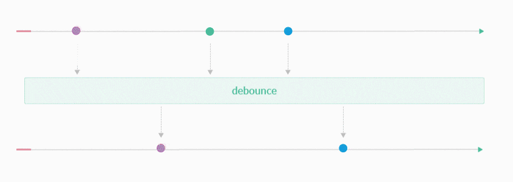

<!--
# ------------------------------------------------------------------------------------|
#                         🚀 README By SANTIAGO ARANGO G 🚀                           #
# ------------------------------------------------------------------------------------|
# 🌐 **Website:** [www.santiagoarangog.com](https://www.santiagoarangog.co)           |
# 📧 **Contact:** [santiago9606@gmail.co](mailto:santiago9606@gmail.com)              |
# 💼 **Author:** Santiago Arango Gutierrez ~ CEO Softyma                              |
# 📅 **Date:** Jule 25, 2025                                                          |
# 🔒 **Copyright:** 2025 Santiago Arango G All rights reserved                        |
# ------------------------------------------------------------------------------------|
-->

<div align="center">
  <a href="https://nestjs.com/" target="_blank">
    
    
  </a>
  <h1>NestJS - Reactive Programming Archetype</h1>
  <p>A project archetype for building scalable and robust backend applications with NestJS, leveraging the principles of Reactive Programming.</p>
</div>

<div align="center">

[](https://github.com/YOUR_USERNAME/YOUR_REPOSITORY)
[](https://nestjs.com)
[](https://github.com/YOUR_USERNAME/YOUR_REPOSITORY/pulls)
[](/LICENSE)

</div>

## 📜 Table of Contents

0.  [**Architecture**]()
1.  [**Overview**](#-overview)
2.  [**Prerequisites**](#-prerequisites)
3.  [**Getting Started**](#️-getting-started)
4.  [**Available Scripts**](#-available-scripts)
5.  [**Testing**](#-testing)
6.  [**Changelog**](#-changelog)
7.  [**Author**](#-author)


## Architecture

```markdown
src
├── 📂 shared/                # Lógica y utilidades compartidas y transversales
│   ├── 📂 domain/
│   │   ├── 📄 value-object.ts
│   │   └── 📄 entity.ts
│   ├── 📂 infrastructure/
│   │   ├── 📂 config/
│   │   ├── 📂 logging/
│   │   └── 📂 middleware/
│   └── 📄 shared.module.ts
│
├── 📂 products/               # Dominio de negocio: "Productos"
│   ├── 📂 application/         # Casos de Uso (orquestación)
│   │   ├── 📂 use-cases/
│   │   │   ├── 📄 create-product.use-case.ts
│   │   │   └── 📄 find-product-by-id.use-case.ts
│   │   └── 📂 ports/           # Puertos de salida (lo que el núcleo necesita del exterior)
│   │       └── 📄 product.repository.port.ts
│   │
│   ├── 📂 domain/              # El núcleo del negocio (agnóstico a la tecnología)
│   │   ├── 📂 model/
│   │   │   ├── 📄 product.entity.ts
│   │   │   └── 📄 product-name.value-object.ts
│   │   └── 📂 services/
│   │       └── 📄 product-finder.service.ts
│   │
│   ├── 📂 infrastructure/      # Adaptadores (implementaciones concretas)
│   │   ├── 📂 driving-adapters/ # Adaptadores de entrada (invocan los casos de uso)
│   │   │   └── 📂 http/
│   │   │       ├── 📂 dto/
│   │   │       │   └── 📄 create-product.dto.ts
│   │   │       └── 📄 products.controller.ts
│   │   │
│   │   └── 📂 driven-adapters/  # Adaptadores de salida (implementan los puertos)
│   │       ├── 📂 typeorm/
│   │       │   ├── 📄 product.schema.ts
│   │       │   └── 📄 product.typeorm.repository.ts
│   │       └── 📂 redis/
│   │           └── 📄 product.redis.repository.ts
│   │
│   └── 📄 products.module.ts    # Módulo de NestJS que une todo
│
├── 📂 users/                   # Otro dominio de negocio...
│   ├── 📂 application/
│   ├── 📂 domain/
│   └── 📂 infrastructure/
│
├── 📄 app.module.ts
└── 📄 main.ts
```

## 🚀 Overview

This project serves as a solid foundation (or `archetype`) for server-side application development using **NestJS**. It incorporates industry best practices and is designed to fully leverage **Reactive Programming** through libraries such as [RxJS](https://rxjs.dev/). This allows for the efficient and declarative handling of asynchronous data streams.

The primary goal is to provide a clean, scalable, and easily maintainable project structure.

<div align="center">
  
</div>

## ✅ Prerequisites

Ensure you have the following software installed on your system:

-   **Node.js**: `^22.0.0` or higher. Using a version manager like [nvm](https://github.com/nvm-sh/nvm) is highly recommended.
-   **NPM**: `^10.0.0` or higher (typically bundled with Node.js).
-   **Operating System**: Linux, macOS, or Windows.


## ⚙️ Getting Started

Follow these steps to get the project running in your local environment.

### 1. Clone the Repository

```sh
git clone [https://github.com/santiagoarangog/nestjs-reactive-programming-app](https://github.com/santiagoarangog/nestjs-reactive-programming-app)
cd nestjs-reactive-programming-app
```

### 2. Install Dependencies

This command will install all project dependencies, including `rimraf` and other development tools.

```sh
npm install
```

### 3. Configure Environment Variables

Create a `.env` file in the project root by copying the example file.

```sh
cp .env.example .env
```

Next, modify the `.env` file with your custom configurations (database credentials, API keys, etc.).

### 4. Run the Application

Start the server in development mode. The application will automatically reload whenever a change in the source code is detected.

```sh
npm run start:dev
```

The application will be available at `http://localhost:3000` (or the port you have configured).

-----

## 📦 Available Scripts

Within the `package.json`, you will find several useful scripts:

  - `npm run start`: Starts the application in production mode.
  - `npm run start:dev`: Starts the application in development mode with hot-reloading.
  - `npm run start:debug`: Starts the application in debug mode with hot-reloading.
  - `npm run build`: Compiles the TypeScript project into JavaScript.
  - `npm run format`: Formats the entire codebase using Prettier.
  - `npm run lint`: Lints the code for style and consistency errors using ESLint.

-----

## 🧪 Testing

This archetype comes pre-configured with [Jest](https://jestjs.io/) for testing.

  - To run all unit and integration tests:
    ```sh
    npm run test
    ```
  - To run tests in watch mode, which re-runs them on every file change:
    ```sh
    npm run test:watch
    ```
  - To generate a test coverage report:
    ```sh
    npm run test:cov
    ```

## 📝 Changelog

For detailed information about the changes in each version, please refer to the [CHANGELOG.md](CHANGELOG.md) file.

## 👨‍💻 Author

Developed and maintained with ❤️ by:

**Santiago Arango Gutiérrez**

  - 📧 **Contact:** [santiago9606@gmail.com](mailto:santiago.arango@experimentality.co)
  - 🌐 **Website:** [santiago-arango-gutierrez](https://www.linkedin.com/in/santiago-arango-gutierrez/)
  - 💼 **GitHub:** [@santiagoarangog](https://github.com/santiagoarangog)

<div align="center">
<small>Copyright © 2025 Santiago Arango G. All rights reserved.</small>
</div>
